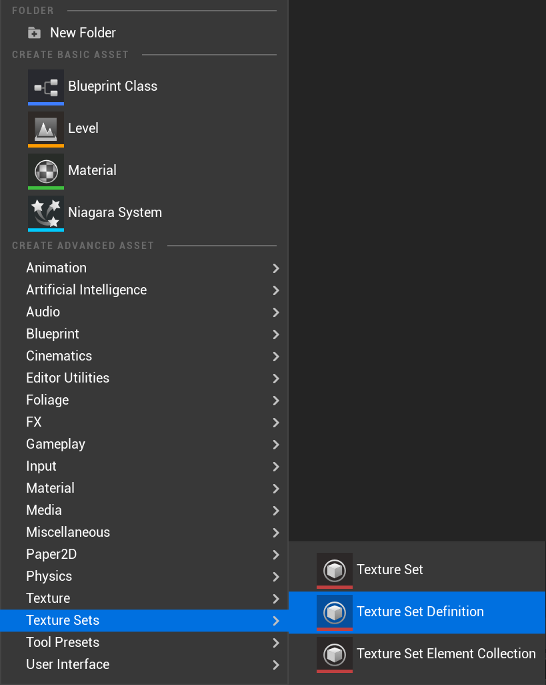
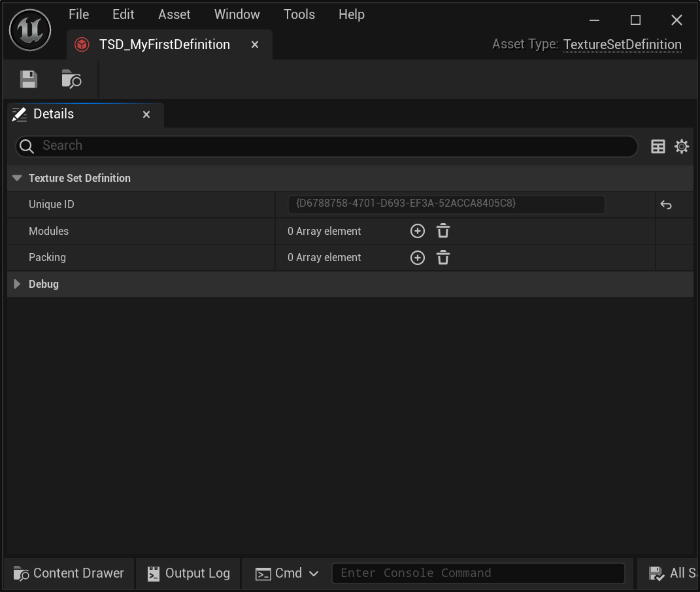
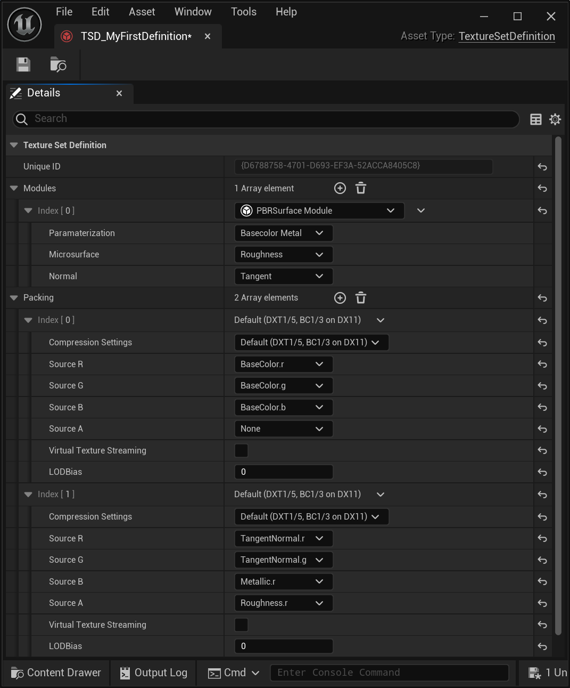
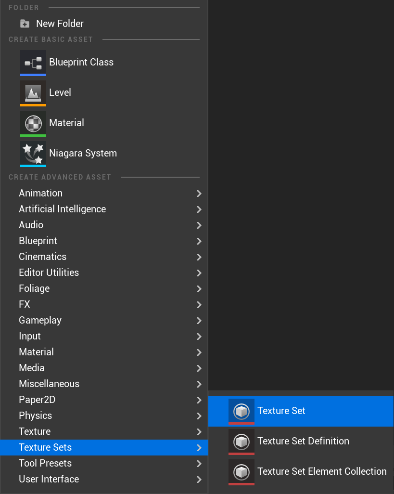
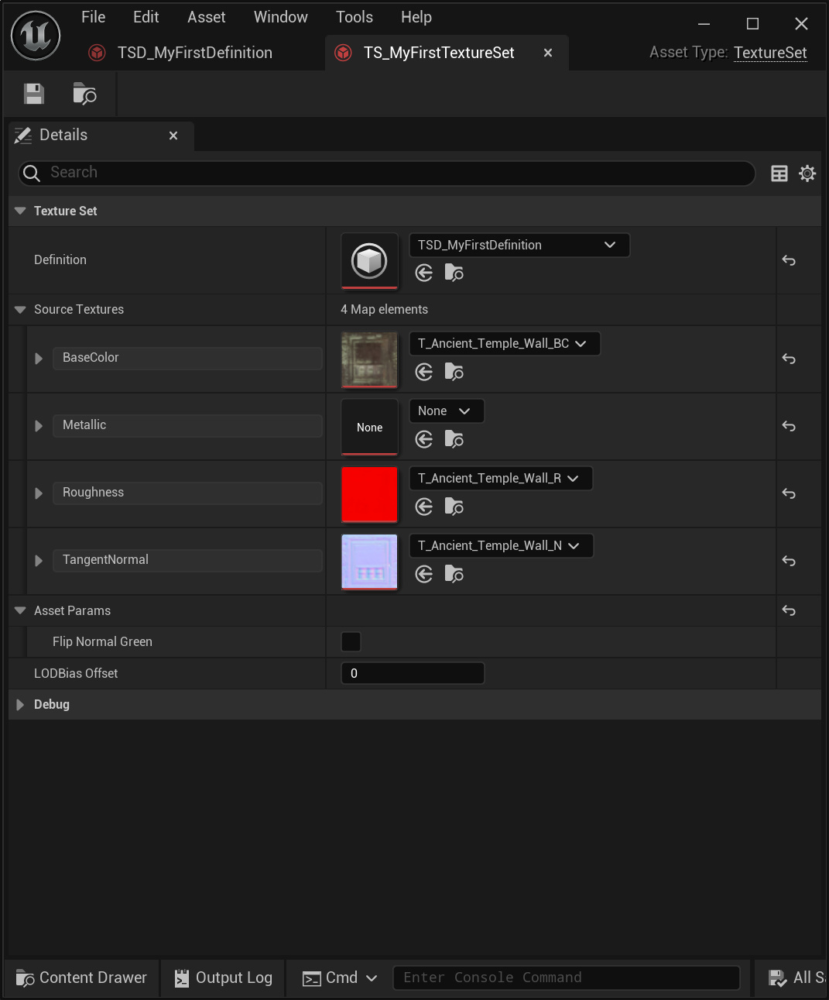
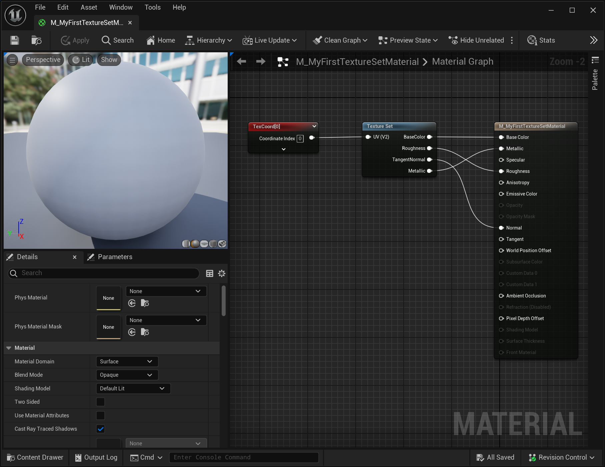
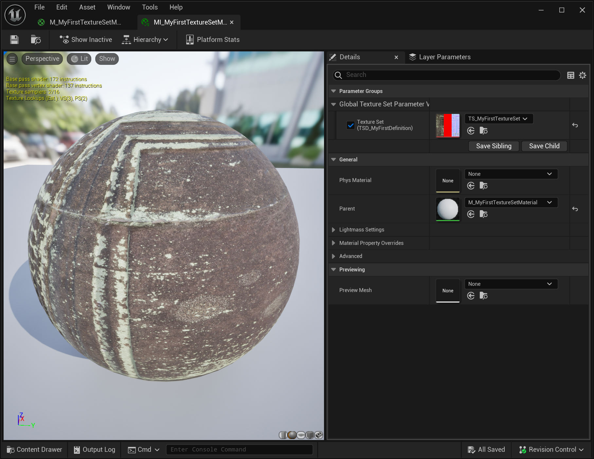

# Quick Start Guide

> **_NOTE:_** Texture sets is a plugin, but currently requires a small number of engine changes to function. For more information see [Installing Texture Sets](./Installation.md)

## Creating a Definition

A texture set definition contains the "template" that texture sets will use. All texture sets and texture set samplers reference a definition to know how to build, process, pack, unpack, sample, and generally handle a specific flavor of texture set.

Usually when creating a new texture set you will reference an existing definition that's already in use across your project, but for the purposed of this exercise, we'll create a new one from scratch.

Create a new asset of type "Texture Set Definition". Typically, texture set definition assets are prefixed with "TSD_".

  

Opening our new definition asset, we can see that it has to lists; a definition list and a packing list.

  

Each module added to the module list is capable of adding input and output elements, as well as attaching additional processing and sampling logic.
For now, add a single "PBR Surface" module. You can configure the properties of the module to determine which elements the PBR surface will contain.

Before we can use this definition, we also need define how the output elements will be packed. Add one or more packing definitions to the packing list and assign each output element to a packed texture channel until all of the elements are packed.

  

Save your newly created definition to trigger it to build and propagate the changes.

> **_NOTE:_** All output elements must be packed, or you will receive a validation error.

## Your first texture set

Now that we have a definition, we can go ahead and create a new texture set.

Create a new asset of type "Texture Set Definition". Typically, texture set definition assets are prefixed with "TS_".

  

Now open the new texture set. The first thing you'll need to do is assign the definition that we just created. When you do, you'll see that it's auto-populated with source texture and asset param fields based on the input elements in the definition.

Assign any textures you wish to each of the source texture fields.

  

Save your newly created texture set to trigger it to build. The build process will automatically pack the source textures behind the scenes according to the packing scheme you previously authored in the texture set definition.

> **_NOTE:_** All source texture input properties are optional. If you don't specify a source texture for a property, a default value will be used.

## Sampling your texture set

To sample your texture set, first create a new material, and in the material add a "Texture Set Sampler" node. In the node properties, again assign the definition you created earlier to the sampler node. You will see the inputs and outputs of the sampler node will populate based on the elements in the definition.

Now wire in a texture coordinate as input, and wire the outputs to the corresponding root node outputs.

  

Next we want to assign our newly created texture set to this parameter. Create a new material instance and assign the newly created material as the parent.

You will see a parameter named "Texture Set" (if you haven't renamed the parameter to something else). Simply assign your texture set to this parameter, and you should see it appear in the preview window!

  
