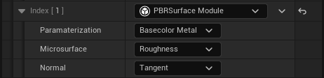
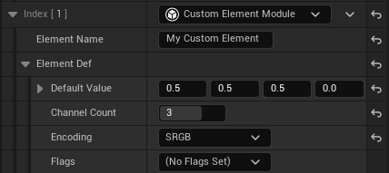
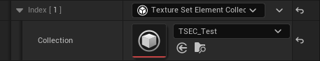
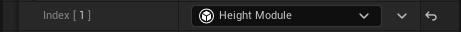
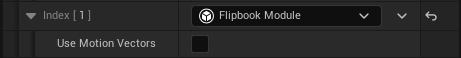
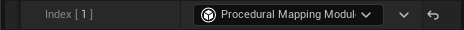

# Standard Modules

A number of texture set modules are included with texture sets which provide functionality we thought would be both 
useful, show the potential of Texture Sets, and provide a standard way of interacting with Texture Sets.

If your team desires custom functionality, texture sets can be extended by building new modules in C++ either from a 
plugin or via game code.

## PBR Surface Module

Defines common, standardized PBR shading elements and handles optional conversion between them.

Features:
- Standardized naming of PBR shading parameters
- Unpack and transform of normal maps to tangent space, world space, or surface gradients with either vertex,
- derivative, or explicitly defined tangents.
- Runtime conversion from Base Color + Metal parameterization to Albedo + Specular and vice-versa.
- Runtime conversion from Smoothness to Roughness and vice-versa.

## Custom Element Module

Allows creation of custom texture map elements inside definition, with explicit control over channel count, default 
values, and encoding.

## Element Collection Module

Similar functionality to the custom element module, but elements collections are defined as one or more custom elements 
in their own data asset which the custom element module then references.

Allows reusing sets of custom elements between definitions across the project.

## Height Module

Adds a heightmap element to the texture set.

Also adds the option to do parallax occlusion mapping in the sampler.

## Flipbook Module

Converts all texture elements into arrays, allowing flipbooking of animated textures.

Features:
- Supports input elements as arrays, or as 2d textures with frames laid out in a texture sheet.
- Attaches meta-data to texture sets to define motion vector scale, flipbook framerate, looping, and more.
- Sample flipbook animation by time (based on frame rate), frame index, or normalized.
- Interpolation for smooth frame transitions.
- Optional motion vectors, used to warp the frames together and provide a smoother animation at lower FPS.

## Procedural Mapping Module

Affects the sampler node, adding the option to sample texture sets with tri-planar mapping.