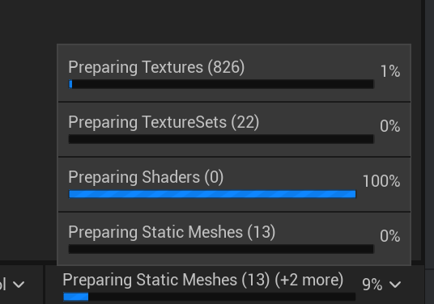

# Compilation

Compilation of texture sets involves taking source data and compiling into derived data, ready to be consumed by the
renderer.

Compilation is handled by a number of classes:
- `UTextureSet`: Does not contain any compiling code direcly, but instead leverages the `FTextureSetCompilingManager`.
- `FTextureSetCompilingManager`: Coordinates queueing pending compilations, kicking off compilations, cleaning up when compilations finish, copying compilation ouputs, and notifying dependent assets.
- `TextureSetCompilerTask`: Coordinates work of compiling a single texture set. Uses `TextureSetCompilerTaskWorker` for code that should run on a task thread.
- `TextureSetCompiler`: Handles initialization of the processing graph, computing hashes for parameters and textures, and evaluating the processing graph and packing definition to produce individual parameter and texture outputs.
- `FTextureSetProcessingGraph`: A collection of `ITextureProcessingNode`s and `IParameterProcessingNode`s which define the processing logic that will produce the elements inside the derived data.
- `UTextureSetTextureSourceProvider`: Allows textures to invoke the compiler if they are missing source data.

## Invoking Compilation (`UTextureSet`)

The compilation process is initiated when `UTextureSet::UpdateDerivedData` is called on a Texture Set. This can be invoked in a 
number of cases: 
- `UTextureSet::PostLoad`, to ensure texture sets will have up to date derived data if they have been updated through version control.
- `UTextureSet::PreSave`, to ensure local edits are applied and derived data is updated.
- `UTextureSet::BeginCacheForCookedPlatformData` so the latest derived data is used in the cook.
- `UTextureSet::AugmentMaterialVectorParameters` if cooking, to ensure up-to-date material parameters are used when cooking dependent assets.
- `UTextureSet::GetDerivedData` incase anyone is requesting a reference to our derived data.
- `UTextureSetDefinition::ApplyEdits` so we update our derived data when our definition has changed.
- `FTextureSetsEditorModule::OnAssetPostImport` so we update our derived data if any of our source textures could have changed.

> **_NOTE:_** `UTextureSet::UpdateDerivedData` can only be called in an uncooked build. In cooked builds, texture sets are expected to have serialized derived data.

After validating that it's referencing a valid definition, the texture set will then call into the `FTextureSetCompilingManager` to either start compiling it immediately, or add it to the queue depending on the function arguments.
The `UTextureSet` set itself doesn't contain any of the compilation logic and `FTextureSetCompilingManager` is now responsible for managing the completion of the compilation. 

## The Compiling Manager (`FTextureSetCompilingManager`)

The `FTextureSetCompilingManager` implements the engine's `IAssetCompilingManager` interface, which allows it to receive ticks, and report the status of in-progress asset compilation to the user in the editor.

  

If the texture set was queued, it will be added to the compiling manager's queue and will eventually compilation will begin via the same code path as if `FTextureSetCompilingManager::StartCompilation` was called directly.

`FTextureSetCompilingManager::StartCompilation` creates an instance of `FTextureSetCompiler` and initializes it with all the required compiler arguments copied from the texture set and definition. Before starting compilation, the compiling manager validates that the texture set in question actually needs to compile. If the compiler finds that the texture set already has up-to-date derived data, then the compilation will be skipped.

If compilation is needed, the compiling manager will create a `TextureSetCompilerTask` which will coordinate the actual compilation work. The compiling manager will ensure that no two texture sets are compiling at the same time and will either abort or wait until the previous compilation finishes before starting a new task.

`FTextureSetCompilingManager::StartCompilation` Will either invoke the task asynchonously, or directly on the game thread depending on the arguments passed to the function. The majority of the time texture sets are compiled asynchronously, except:
- Default texture sets, which are used as fallbacks for texture sets which have not yet compiled. These are compiled on the main thread as soon as a change to the definition is detected. (They compile extrememely fast as they are typically 4x4 default textures)
- In the case of a texture set's derived data being requested via `UTextureSet::GetDerivedData` which indicates another piece of code requires the derived data immediately. This typically only happens during a cook so blocking the main thread is less of an issue.
- Compilation being invoked by `UTextureSet::PreSave` while saving for a cook. This ensures that up-to-date derived data will be saved. If not saving for cook, the derived data is not serialized so doesn't need to be updated.

`FTextureSetCompilingManager` will handle the execution of the `TextureSetCompilerTask`. When the task has finished, the compiling manager will handle swapping out the derived data of the texture set via `FTextureSetCompilingManager::AssignDerivedData` and then notify all concerned material instances to refresh via `FTextureSetCompilingManager::NotifyMaterialInstances`.

## The Compiler Task (`TextureSetCompilerTask`)

The `TextureSetCompilerTask` coordinates the work of compiling a single texture set. All functions of the `TextureSetCompilerTask` are expected to execute on the game thread, invoked by the `FTextureSetCompilingManager`. It leverages `FTextureSetCompilerTaskWorker` to exececute as much of the work as is safe to run on an worker thread.

Both `TextureSetCompilerTask` and `FTextureSetCompilerTaskWorker` leverage the instance of the `FTextureSetCompiler` that was created by the `FTextureSetCompilingManager` in `FTextureSetCompilingManager::StartCompilation`, and which contains all the arguments and state and does the actual work of compilation. Computation of each invidivual element of the derived data (Texture or Parameter) are wrapped in an implementation of `FDerivedDataPluginInterface` which leverages the DDC to retreive the computed data from the cache if it exists. Only if there is a cache miss do we actually invoke the `FTextureSetCompiler` to compute the data.

> **_NOTE:_** For textures, only the metadata assosciated with the texture (such as min and max values) is stored in the DDC, as storing the uncompressed, computed source data for a texture is actually slower than re-computing it. Instead, we have a mechanism to re-compile the texture data on demand if it's missing when building the texture, and we rely on the existing engine texture pipeline to cache the fully built texture data. See the `UTextureSetTextureSourceProvider` for more details.

The `FTextureSetCompilingManager` repeatedly calls `TextureSetCompilerTask::TryFinalize` to check if the task has finished. When `TextureSetCompilerTask::TryFinalize` returns true, the compiling manager will proced to clean up the task.

## Compiling The Derived Data (`FTextureSetCompiler`)

The `FTextureSetCompiler` stores it's own copy of all the inputs required to build data, so in the event the source data changes (such as a definition parameter being edited) while a compiler is being used, the in-flight compiler will be unaffected.

The compiler has a processing graph instance which it initializes, and then leverages to compute the various parts of derived data.

Computing parameters are pretty straight forward: `FTextureSetCompiler::BuildParameterData` computes the result of a single output parameter to be stored in the derived data.

To compute the texture data, there are multiple steps. This is mainly because of the interaction between texture sets and the engine, where we will be writing the texture data directly to the UTexture's source mips. The following functions are called in order for each derived texture:
- `FTextureSetCompiler::ConfigureTexture` is first called from the game thread and configures the derived `UTexture`'s properties. This also sets the texture's source ID to a hash of all the inputs to that texture's build, which allow it's derived data to be recovered from the DDC, potentially avoiding the need for further compilation.
- `FTextureSetCompiler::InitializeTextureSource` is called again from the game thread when further compilation is required, In this function we initialize the source data to the correct format and dimensions in prepreation for generation.
- `FTextureSetCompiler::GenerateTextureSource`: Handles the actual texture generation and is invoked on a worker thread (will go into more detail below).
- `FTextureSetCompiler::FreeTextureSource`: Releases the memory allocated during the build. This is again called on the main thread, after the derived texture has been built and it no longer needs it's source (`UTextureSetTextureSourceProvider` will ensure the source can be recovered if it's needed again)

> **_NOTE:_** `FTextureSetCompiler::InitializeTextureSource` DOES NOT allocate data for the texture source, as it would potentially result in an avalanche of allocations while textures are queued and waiting to build, resulting in an OOM situation. Instead, the source is initialized with all the correct meta-data but an empty buffer, and the buffer is filled during `FTextureSetCompiler::GenerateTextureSource`.

`FTextureSetCompiler::GenerateTextureSource` does the bulk of the computation and writes out images to the `UTextre`'s source data so it can be built. The function references the `FTextureSetPackedTextureDef` from the texture set definition to determine which processing graph outputs should be stored in each channel of the derived texture. It works channel by channel, computing and writing the data as it goes. When the data is written, it then runs the encoding (range compression, and sRGB) on the final data.

The generated texture source is currently always in full FP32 precision, and it's up to the engine's texture pipeline to convert it back down to the appropriate runtime format. This is also why it's critical for us not to keep the texture source in memory longer than is needed.

## Executing The Processing Graph (`FTextureSetProcessingGraph`)

The `FTextureSetProcessingGraph` is the extensible part of of the compilation process. Each `UTextureSetModule` in the texture set definition has an opportunity to configure the processing graph during it's construction via `UTextureSetModule::ConfigureProcessingGraph`, adding and connecting nodes within the graph. By the time a compiler is created, it has a fully constructed processing graph.

The inputs to the processing graph are supplied from the texture set being compiled. Each texture set will provide texture inputs, as well as asset parameters to the graph.

The compiler uses the outputs of the graph to compile the derived data. The result of each parameter output of the graph is saved to the derived data, and each channel of each texture output of the graph is packed to the derived textures based on the packing defined in the definition.

The processing graph also supports recursive hashing. Each output node of the graph can calculate a hash for both the configuration of the graph, and for it's expected output data.
- `IProcessingNode::ComputeGraphHash` is used to determine if the graph itself has changed. This is usually caused by a modification of the texture set definition in which case all texture sets using this graph will need to be invalidated.
- `IProcessingNode::ComputeGraphHash` is used to determine if either the graph or any data that will affect the result of this node has changed. It's usually changed when a texture set is modified causing it to be invalidated.

Since each output is hashed individually, we can efficiently recover computed data from the DDC per-output. This means that changing just one input parameter will only require fully recompiling the specific outputs of the graph that it affects.

## Source Provider (`UTextureSetTextureSourceProvider`)

We leverage existing texture pipeline as much as possible by using UTexures. The compiler provides `UTexture`s with an uncompressed source image, and then triggers the engine's existing texture pipeline to build it. As mentioned previously, the uncompressed source data is quite large and it's more efficient to discard it and recover it if the texture ever needs to build again (due to cooking for a different platform, for instance). This saves both serializing and keeping in memory a large amount of what is essentially intermediate data.

Due to the engine scheduling the texture builds, a build may be invoked while the source data is empty, and we can't always guarantee the compiling manager has filled it in. `UTextureSetTextureSourceProvider` provides a mechanism to ensure the texture's soruce data is filled just before the texture starts building (and on the texture build's worker thread), and is then discarded when it finishes.

`UTextureSetTextureSourceProvider` implements `UProceduralTextureProvider` which is a divergent extensibility mechanism we implemented for this purpose.

The `UTextureSetTextureSourceProvider` uses it's own instance of a `FTextureSetCompiler` with to goal of using as similar of a code path as the `TextureSetCompilerTask` to aid in maintainability.

> **_NOTE:_** Because of the asynchronous nature of the build process, and because we don't explicity control the invokation of the `UTextureSetTextureSourceProvider`, it is possible to have cases where both a `UTextureSetTextureSourceProvider` and 
`TextureSetCompilerTask` are attempting to compile data for the same derived texture. For this reason `FDerivedTexture` includes a `FCriticalSection` to avoid race conditions, as well as an enum (`EDerivedTextureState`) to track the state of it's source data, and avoid the potential of wastefully computing it multiple times.