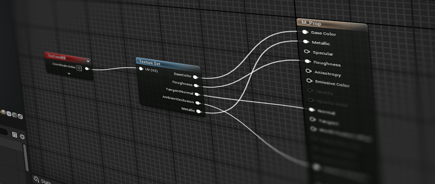

# Texture Sets

Texture sets is a plugin developed for UE5, and provides an opt-in framework for building advanced, streamlined texture 
pipelines.

# Basic Concepts

Texture sets has 3 main user-facing components that define the framework:
- **Texture Set:** The texture set asset itself. Imported from a raw asset (texture files, PSD, substance file) or by 
referencing existing textures in the project. References a **Texture Set Definition** to define the required inputs.
- **Texture Set Definition:** A data asset built from modules; defines inputs, outputs, a packing scheme, and
- compression formats.
- **Texture Set Sampler:** In the shader graph, a new type of texture node, similar to an existing Texture Sampler. 
References a **Texture Set Definition**, and creates a Texture Set parameter for the shader. Node outputs are unpacked 
sample values, as defined by the Texture Set Definition.

Want to know more of the nitty gritty? Check out the [Technical Overview](./Docs/TechnicalOverview.md).

# Benefits of Texture Sets

- Opt-in. Doesn't break or invalidate any existing data. Loose texture assets still exist.

### For Artists:
- Texture Sets eliminates the need for manual texture packing. Just import your texture maps, and the packing happens 
behind the scenes.
- Texture settings are standardized and centralized. Never worry about sRGB settings or selecting the right compression 
format again!
- Co-authored textures are stored together in data. Just assign one texture set to your material and all the appropriate
maps and material parameters are set together.

### For Material Artists:
- Decompression and unpacking of textures happen automatically inside the sampler node. No need to swizzle channels to
undo texture packing in the graph.
- Common well-defined techniques such as flipbooking or parallax occlusion mapping which are often difficult or messy to
support in a material graph. These can be implemented once and handled with the click of a button on the sampler.

### For Art Leads and Technical Artists:
- Texture Sets Provide project-wide control of texture packing layouts and compression formats, allowing iteration and
optimization later in production without the need for data-patching.
- Increase asset portability; Import assets from external sources and leverage texture sets to bring them in-line with
project standards without needing to alter the raw data.

### For Engineers
- Provides a framework for advanced compression or rendering techniques that require both pre-processing and runtime
logic, and are typically cumbersome or near impossible to implement at a production scale traditionally. e.g. NDF 
pre-filtering, relaxed cone-step mapping, derivative mapping, vertex animation compression.
- Provide optimized implementations of common complex material techniques in code, which are easily accessible to
material artists. e.g. triplanar mapping, flipbooking with motion vectors, parallax occlusion mapping.

Ready to try it out? Jump in to the [Quick Start Guide](./Docs/QuickStart.md) and create your first Texture Set!

# Contributing

See [CONTRIBUTING](./CONTRIBUTING.md)